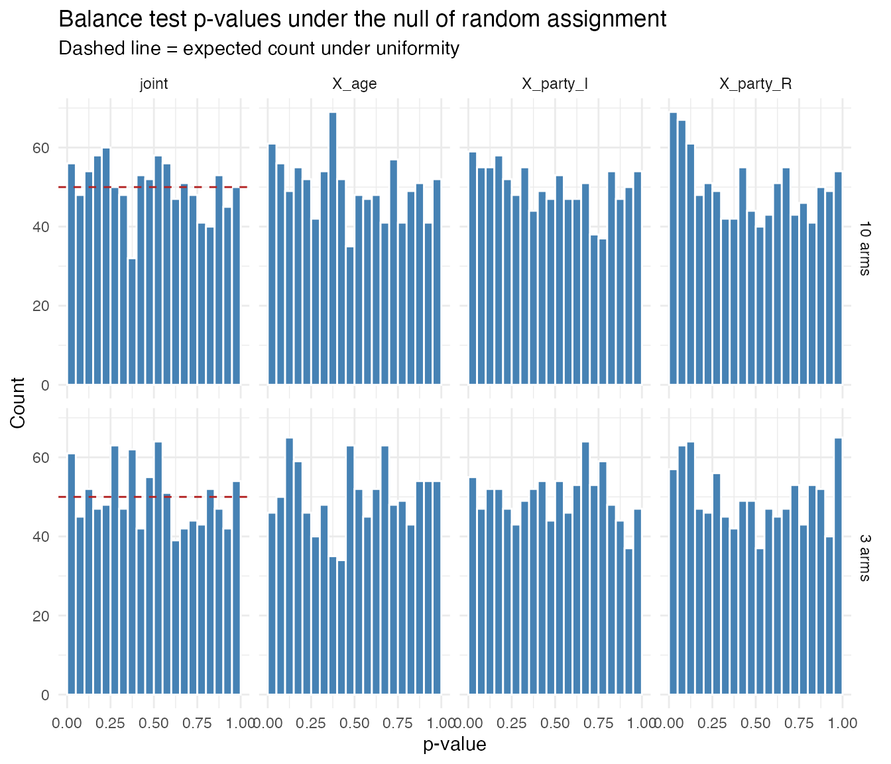

# Balance Test Calibration

``` r

library(excheckr)
library(DeclareDesign)
library(estimatr)
library(dplyr)
library(ggplot2)
```

## Balance testing in a three-arm trial

Consider a simple experiment with three treatment arms (Control, T1,
T2), one continuous covariate (age), and one categorical covariate
(party ID). Under random assignment, covariates should be independent of
treatment, so balance tests should only reject at the nominal rate.

[`check_balance()`](https://alexandercoppock.com/excheckr/reference/check_balance.md)
returns two sets of tests: covariate-by-covariate F-tests (regressing
each covariate on treatment dummies) and a joint test of all covariates
simultaneously.

``` r

set.seed(42)

dat <- fabricate(
  N = 200,
  X_age   = rnorm(N, 50, 10),
  X_party = sample(c("D", "R", "I"), N, replace = TRUE),
  Z = complete_ra(N, conditions = c("Control", "T1", "T2"))
)

res <- check_balance(dat, Z, covariates = c("X_age", "X_party"), quiet = FALSE)
#> Covariate-by-covariate balance tests:
#> # A tibble: 3 × 8
#>   covariate level F_stat statistic   df1   df2 p_value  nobs
#>   <chr>     <chr>  <dbl> <chr>     <int> <int>   <dbl> <int>
#> 1 X_age     NA     1.10  F             2   197   0.336   200
#> 2 X_party   I      2.31  F             2   197   0.102   200
#> 3 X_party   R      0.713 F             2   197   0.491   200
#> 
#> Joint balance test:
#> # A tibble: 1 × 10
#>   F_stat statistic   df1   df2 p_value p_value_classical  nobs obs_per_param
#>    <dbl> <chr>     <int> <int>   <dbl>             <dbl> <int>         <dbl>
#> 1   1.32 LR/df         6    NA   0.243                NA   200          33.3
#> # ℹ 2 more variables: status <chr>, estimable <lgl>
```

For multi-armed treatments, the covariate-by-covariate tests are F-tests
with `K - 1` numerator degrees of freedom (jointly testing all treatment
dummies). The joint test uses a multinomial likelihood-ratio test: it
fits a multinomial logistic regression of treatment on all covariates
via [`nnet::multinom`](https://rdrr.io/pkg/nnet/man/multinom.html) and
compares to an intercept-only model.

## Calibration under the null

Under the null of random assignment, a well-calibrated test should
reject at rate $`\alpha`$ when tested at level $`\alpha`$. We check this
by simulation, varying the number of treatment arms and the sample size.

The quantity that governs the joint test is not the number of arms on
its own. The multinomial model estimates $`q = (K-1)p`$ coefficients,
where $`p`$ is the number of model-matrix columns the covariates expand
to, and the chi-squared reference distribution for the likelihood-ratio
statistic is asymptotic in $`N/q`$. Two of the three designs below are
comfortable on that ratio and one is not.

``` r

balance_handler <- function(data) {
  res <- check_balance(data, Z, covariates = c("X_age", "X_party"), quiet = TRUE)
  bind_rows(
    res$covariate_tests |>
      transmute(
        term = ifelse(is.na(level), covariate, paste0(covariate, "_", level)),
        estimate = F_stat,
        p.value = p_value
      ),
    res$joint_test |>
      transmute(term = "joint", estimate = F_stat, p.value = p_value)
  )
}
```

### Three-arm trial

``` r

design_3arm <-
  declare_model(
    N = 200,
    X_age   = rnorm(N, 50, 10),
    X_party = sample(c("D", "R", "I"), N, replace = TRUE)
  ) +
  declare_assignment(
    Z = complete_ra(N, conditions = c("Control", "T1", "T2"))
  ) +
  declare_estimator(
    handler = label_estimator(balance_handler),
    label = "balance_test"
  )
```

``` r

set.seed(343)
sims_3arm <- simulate_design(design_3arm, sims = 1000) |>
  mutate(K = 3)
```

### Ten-arm trial

``` r

design_10arm <-
  declare_model(
    N = 500,
    X_age   = rnorm(N, 50, 10),
    X_party = sample(c("D", "R", "I"), N, replace = TRUE)
  ) +
  declare_assignment(
    Z = complete_ra(N, conditions = paste0("T", 1:10))
  ) +
  declare_estimator(
    handler = label_estimator(balance_handler),
    label = "balance_test"
  )
```

``` r

set.seed(343)
sims_10arm <- simulate_design(design_10arm, sims = 1000) |>
  mutate(K = 10)
```

### Eight arms in a small sample

The same eight-arm structure on 150 respondents, with five candidate
covariates rather than two. The covariates expand to six model-matrix
columns, so the multinomial model estimates $`7 \times 6 = 42`$
coefficients from 150 observations: a ratio of roughly 3.6 observations
per coefficient.

``` r

thin_handler <- function(data) {
  res <- check_balance(data, Z, covariates = paste0("X_", 1:5), quiet = TRUE)
  bind_rows(
    res$covariate_tests |>
      transmute(
        term = ifelse(is.na(level), covariate, paste0(covariate, "_", level)),
        estimate = F_stat,
        p.value = p_value
      ),
    res$joint_test |>
      transmute(term = "joint", estimate = F_stat, p.value = p_value)
  )
}

design_thin <-
  declare_model(
    N = 150,
    X_1 = rnorm(N),
    X_2 = sample(c("D", "R", "I"), N, replace = TRUE),
    X_3 = rnorm(N),
    X_4 = rnorm(N),
    X_5 = rnorm(N)
  ) +
  declare_assignment(
    Z = complete_ra(N, conditions = paste0("T", 1:8))
  ) +
  declare_estimator(
    handler = label_estimator(thin_handler),
    label = "balance_test"
  )
```

``` r

set.seed(343)
sims_thin <- simulate_design(design_thin, sims = 1000)
```

``` r

sims_thin |>
  group_by(test = ifelse(term == "joint", "joint", "covariate")) |>
  summarize(
    n_estimable = sum(!is.na(p.value)),
    rejection_rate = mean(p.value <= 0.05, na.rm = TRUE),
    .groups = "drop"
  )
#> # A tibble: 2 × 3
#>   test      n_estimable rejection_rate
#>   <chr>           <int>          <dbl>
#> 1 covariate        6000         0.0895
#> 2 joint            1000         0.094
```

The joint test rejects at roughly twice the nominal rate. The
likelihood-ratio statistic is biased upward in small samples and
dividing it by its degrees of freedom does not remove the bias, so the
test rejects too often exactly where a researcher most wants
reassurance.

The covariate-by-covariate tests are also above nominal here, which the
three-arm and ten-arm designs above did not reveal. That is the same
mechanism rather than a second one. With eight arms, each covariate test
is an F-test with seven numerator degrees of freedom, not one, and on
150 respondents split across eight arms there are about 19 observations
per arm to estimate them from. Per covariate the rates run from 0.065 to
0.113:

``` r

sims_thin |>
  filter(term != "joint") |>
  group_by(term) |>
  summarize(rejection_rate = mean(p.value <= 0.05, na.rm = TRUE), .groups = "drop")
#> # A tibble: 6 × 2
#>   term  rejection_rate
#>   <chr>          <dbl>
#> 1 X_1            0.065
#> 2 X_2_I          0.102
#> 3 X_2_R          0.113
#> 4 X_3            0.089
#> 5 X_4            0.08 
#> 6 X_5            0.088
```

So the lesson is about degrees of freedom rather than about which test
you picked. A covariate-by-covariate test is well calibrated when
treatment is binary, because it is then a single-degree-of-freedom test.
Add arms and it becomes a multi-degree-of-freedom test subject to the
same small-sample problem as the joint test.

## Results

``` r

sims <- bind_rows(sims_3arm, sims_10arm)

rejection_rates <-
  sims |>
  group_by(K, term) |>
  summarize(
    rejection_rate = mean(p.value <= 0.05),
    mean_F = mean(estimate),
    .groups = "drop"
  ) |>
  mutate(nominal_rate = 0.05)

rejection_rates
#> # A tibble: 8 × 5
#>       K term      rejection_rate mean_F nominal_rate
#>   <dbl> <chr>              <dbl>  <dbl>        <dbl>
#> 1     3 X_age              0.046   1.01         0.05
#> 2     3 X_party_I          0.055   1.04         0.05
#> 3     3 X_party_R          0.057   1.08         0.05
#> 4     3 joint              0.061   1.03         0.05
#> 5    10 X_age              0.061   1.04         0.05
#> 6    10 X_party_I          0.059   1.04         0.05
#> 7    10 X_party_R          0.069   1.06         0.05
#> 8    10 joint              0.056   1.01         0.05
```

The covariate-by-covariate tests sit at the nominal 5% rate in both
designs, and so does the joint test. Read that as a statement about
these two designs rather than about arms in general: the three-arm
design has about 33 observations per estimated coefficient and the
ten-arm design about 19, both comfortable. A wider sweep at 2000
simulations per cell shows the ratio, not the arm count, doing the work.

| $`N`$ | $`K`$ | columns $`p`$ | $`q = (K-1)p`$ | $`N/q`$ | rejection rate |
|------:|------:|--------------:|---------------:|--------:|---------------:|
|  2000 |     3 |             3 |              6 |     333 |          0.052 |
|   500 |     3 |             3 |              6 |      83 |          0.053 |
|   200 |     3 |             3 |              6 |      33 |          0.048 |
|   500 |    10 |             3 |             27 |      19 |          0.060 |
|   200 |    10 |             3 |             27 |     7.4 |          0.069 |
|   100 |     4 |             6 |             18 |     5.6 |          0.082 |
|   150 |     8 |             6 |             42 |     3.6 |          0.095 |

Rejection is monotone in $`N/q`$ and $`K`$ enters only through $`q`$.
Above roughly 30 observations per coefficient the test is at nominal;
below about 10 it is anti-conservative enough to mislead. Adding arms
hurts because it multiplies $`q`$, and so does adding covariates; a
ten-arm trial with a large sample is fine and a four-arm trial with five
covariates on 100 respondents is not.

``` r

sims_plot <- sims |> mutate(K = paste0(K, " arms"))

expected_df <- sims_plot |>
  filter(term == "joint") |>
  group_by(K, term) |>
  summarise(expected = n() / 20, .groups = "drop")

sims_plot |>
  ggplot(aes(x = p.value)) +
  geom_histogram(breaks = seq(0, 1, 0.05), fill = "steelblue", color = "white") +
  geom_hline(data = expected_df, aes(yintercept = expected),
             linetype = "dashed", color = "firebrick") +
  facet_grid(K ~ term) +
  labs(x = "p-value", y = "Count",
       title = "Balance test p-values under the null of random assignment",
       subtitle = "Dashed line = expected count under uniformity") +
  theme_minimal()
```



## Randomization inference for clustered designs

Clustering breaks the parametric joint test, and breaks it worse than a
thin sample does. In a 30-cluster design with three individual-level
covariates, the joint test rejects at **12.8%** against a nominal 5%
even when `clusters` and `se_type = "CR2"` are supplied.

The denominator degrees of freedom are not the problem, so there is
nothing to correct. Substituting the number of clusters for the residual
degrees of freedom moves the rejection rate from 11.4% to 11.2%, and a
chi-squared reference gives 14.5%. The cluster-robust variance estimator
is itself biased downward here, because treatment is constant within a
cluster: the effective sample size for regressing a cluster-constant
treatment on individual-level covariates is the number of clusters, not
the number of respondents.

Supplying a `declaration` replaces the parametric reference distribution
with the randomization distribution under the declared assignment
mechanism, using the same multinomial LR statistic. In the same
30-cluster design that rejects at 12.8% parametrically, randomization
inference rejects at **4.5%**.

[`check_balance()`](https://alexandercoppock.com/excheckr/reference/check_balance.md)
warns when `clusters` is passed without a `declaration`, for this
reason. The covariate-by-covariate tests are unaffected: they are
single-degree-of-freedom tests and are well calibrated with
cluster-robust standard errors, at 4.8% to 5.6% in the same design.

``` r

library(randomizr)

set.seed(44)
n_clusters <- 30
cluster_size <- 10
n <- n_clusters * cluster_size

dat_cl <- fabricate(
  N = n,
  cluster_id = rep(1:n_clusters, each = cluster_size),
  X_age   = rnorm(N, 50, 10),
  X_party = sample(c("D", "R", "I"), N, replace = TRUE),
  Z = cluster_ra(clusters = cluster_id, conditions = c("C", "T1", "T2"))
)

decl <- declare_ra(
  clusters = dat_cl$cluster_id,
  conditions = c("C", "T1", "T2")
)

res_ri <- check_balance(
  dat_cl, Z,
  covariates = c("X_age", "X_party"),
  declaration = decl,
  sims = 500,
  quiet = FALSE
)
#> Covariate-by-covariate balance tests:
#> # A tibble: 3 × 8
#>   covariate level F_stat statistic   df1   df2 p_value  nobs
#>   <chr>     <chr>  <dbl> <chr>     <int> <int>   <dbl> <int>
#> 1 X_age     NA     3.11  F             2   297  0.0462   300
#> 2 X_party   I      0.290 F             2   297  0.749    300
#> 3 X_party   R      0.101 F             2   297  0.904    300
#> 
#> Joint balance test:
#> # A tibble: 1 × 10
#>   F_stat statistic   df1   df2 p_value p_value_classical  nobs obs_per_param
#>    <dbl> <chr>     <int> <int>   <dbl>             <dbl> <int>         <dbl>
#> 1   6.92 LR           NA    NA   0.258                NA   300            NA
#> # ℹ 2 more variables: status <chr>, estimable <lgl>
```

The RI joint test p-value is exact by construction: it compares the
observed multinomial LR statistic to its randomization distribution
under the declared assignment mechanism.

## What randomization inference asks of you

The machinery is
[`ri2::conduct_ri()`](https://alexandercoppock.com/ri2/reference/conduct_ri.html),
with the multinomial likelihood-ratio statistic as the test function and
the p-value taken from the upper tail. `ri2` is in Suggests rather than
Imports, so the RI path errors with an install hint if it is missing,
and everything else in the package works without it.

“Exact by construction” is conditional on the construction being right,
and three things have to hold.

**The declaration must describe the assignment mechanism that actually
ran.** RI compares the observed statistic to the distribution of
statistics under the permutations the declaration allows. Declare the
wrong mechanism and you get an exact p-value for an experiment nobody
ran, which is worse than an approximate one for the right experiment. If
assignment was blocked, the declaration needs the blocks; if clustered,
the clusters. `declaration = "complete"` is shorthand for complete
random assignment holding the observed arm sizes fixed, which is a
reasonable default for a within-stratum balance test but is a real
assumption, not a formality.

**One row per randomized unit.** This is the trap worth naming, because
nothing errors when you fall into it. If treatment was assigned to
respondents and your data has several rows per respondent, a declaration
that permutes rows independently breaks the design and the resulting
p-values are anti-conservative. Check it rather than assume it:

``` r

# does any unit appear more than once in the data being permuted?
dat |>
  dplyr::count(resp_id) |>
  dplyr::filter(n > 1) |>
  nrow()
```

In one real corpus of 99 studies this held for 98 of them, and the
exception was a within-subjects design whose declaration had to cluster
on the respondent identifier. Two of the other studies were also
within-subjects, but their balance checks ran within topic, and since a
respondent contributes one row per topic each stratum was one row per
respondent after all. The point is that the answer was not guessable
from the design description.

**It costs real time.** Each simulation refits the test function, so an
RI joint test is roughly `sims` multinomial fits. On a corpus that meant
about one study per 40 seconds at `sims = 1000`, against effectively
nothing for the parametric test. Budget for it, and consider running RI
as a separate confirmatory pass over the studies that need it rather
than inside the main checking loop.

None of this argues against RI. It is the right tool when the parametric
reference distribution is untrustworthy, which the numbers above show it
often is. It argues for spending a few minutes establishing what the
design was before declaring it.
