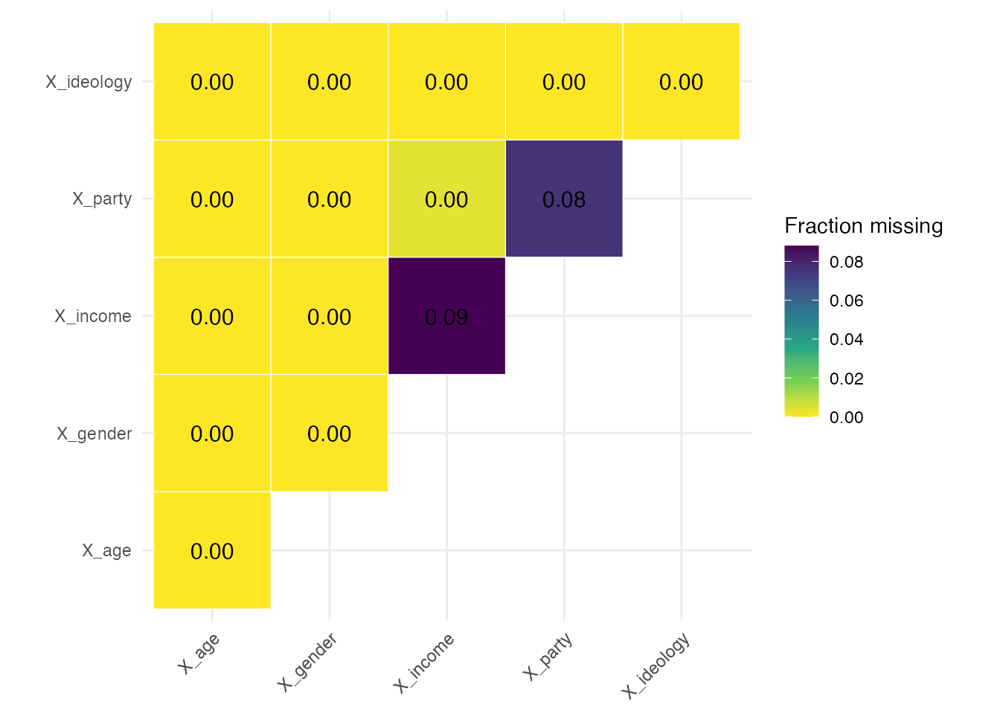

# Checking One Experiment

``` r

library(excheckr)
library(dplyr)
library(tidyr)
library(randomizr)
```

A cleaned experimental dataset invites four questions. Are the outcomes
on the scale you think they are on? Which covariates have missing
values, and what did you do about them? Did randomization balance the
covariates? Did treatment affect who is missing an outcome? This
vignette answers all four on a simulated study built with known
problems, so that the checks have something to find.

Every check takes a `study_id` and appends it to its output. That is
what makes the results stackable across studies later, which is the
subject of
[`vignette("checking_many_studies")`](https://alexandercoppock.com/excheckr/articles/checking_many_studies.md).

## A study with planted problems

Treatment is assigned at the cluster level, which matters later: a
clustered design changes which balance test is trustworthy. `X_income`
and `X_party` carry missing values, and `Y_attitude` is missing more
often among the treated, so the attrition check should flag it and the
balance checks should not.

``` r

set.seed(123)

n_clusters <- 25
cluster_size <- 20
n <- n_clusters * cluster_size

dat <- tibble(
  cluster_id = rep(seq_len(n_clusters), each = cluster_size),
  X_age = rnorm(n, 45, 15),
  X_gender = sample(c("Male", "Female", "Other"), n, replace = TRUE,
                    prob = c(0.48, 0.48, 0.04)),
  X_income = exp(rnorm(n, 11, 0.8)) * 1000,
  X_party = factor(sample(c("Democrat", "Republican", "Independent"), n,
                          replace = TRUE, prob = c(0.35, 0.30, 0.35))),
  X_ideology = sample(1:7, n, replace = TRUE)
) |>
  mutate(
    Z = cluster_ra(clusters = cluster_id),
    # Covariates go missing at random, unrelated to treatment
    X_income = if_else(runif(n) < 0.08, NA_real_, X_income),
    X_party = if_else(runif(n) < 0.06, NA, X_party),
    # Y_attitude drops out more often among the treated; Y_behavior does not
    Y_attitude = if_else(runif(n) < if_else(Z == 1, 0.35, 0.25), NA_real_,
                         plogis(0.5 * Z + 0.01 * X_age + rnorm(n))),
    Y_behavior = if_else(runif(n) < 0.20, NA_real_,
                         plogis(0.2 * Z + rnorm(n, 0, 0.5)))
  )

dat
#> # A tibble: 500 × 9
#>    cluster_id X_age X_gender   X_income X_party     X_ideology     Z Y_attitude Y_behavior
#>         <int> <dbl> <chr>         <dbl> <fct>            <int> <int>      <dbl>      <dbl>
#>  1          1  36.6 Female   204995675. Republican           2     0      0.711      0.315
#>  2          1  41.5 Male      54843105. Independent          3     0     NA          0.541
#>  3          1  68.4 Female    90145166. Republican           4     0      0.199      0.473
#>  4          1  46.1 Male      71051936. Democrat             2     0     NA         NA    
#>  5          1  46.9 Male      51591048. Independent          3     0      0.750     NA    
#>  6          1  70.7 Female    54376369. Independent          2     0      0.828     NA    
#>  7          1  51.9 Male     134627565. Independent          5     0      0.388      0.471
#>  8          1  26.0 Female    50961895. Republican           5     0      0.768     NA    
#>  9          1  34.7 Female    11729403. Republican           5     0      0.260      0.464
#> 10          1  38.3 Female    51189443. Independent          4     0     NA          0.621
#> # ℹ 490 more rows
```

## Are the outcomes on the expected scale?

[`check_y_bounds()`](https://alexandercoppock.com/excheckr/reference/check_y_bounds.md)
reports the range of every `Y_` column and flags anything outside the
unit interval. Both outcomes here are probabilities, so both should
pass.

``` r

check_y_bounds(dat, study_id = "demo_study_1")
#> # A tibble: 2 × 5
#>   variable      min   max in_bounds study_id    
#>   <chr>       <dbl> <dbl> <lgl>     <chr>       
#> 1 Y_attitude 0.0907 0.980 TRUE      demo_study_1
#> 2 Y_behavior 0.195  0.813 TRUE      demo_study_1
```

A `FALSE` in `in_bounds` almost always means a cleaning error rather
than a finding: a percentage left on a 0 to 100 scale, or a
reverse-coded item that never got recoded. Fix it at the source.

## Which covariates are missing, and were they imputed?

[`check_covariate_missingness()`](https://alexandercoppock.com/excheckr/reference/check_covariate_missingness.md)
prints a summary and returns a joint-missingness heatmap. The diagonal
is each covariate’s own missingness rate; an off-diagonal cell is the
share of rows missing both, so a cell close to its diagonal neighbours
means the two go missing together.

``` r

missingness <- check_covariate_missingness(dat)
#> # A tibble: 5 × 4
#>   variable   total_cases total_missing_cases fraction_missing_cases
#>   <chr>            <int>               <int>                  <dbl>
#> 1 X_age              500                   0                  0    
#> 2 X_gender           500                   0                  0    
#> 3 X_income           500                  44                  0.088
#> 4 X_party            500                  38                  0.076
#> 5 X_ideology         500                   0                  0
```



[`write_covariate_imputation_code()`](https://alexandercoppock.com/excheckr/reference/write_covariate_imputation_code.md)
does not impute anything. It prints code for you to read and paste, so
the imputation lands in your script where a reader can see it rather
than inside a function call.

``` r

write_covariate_imputation_code(dat)
#> dat <-
#>   dat |>
#>   mutate(
#> X_age_nona = replace_na(X_age, median(X_age, na.rm = TRUE)),
#> X_age_missing = if_else(is.na(X_age), 1, 0),
#> X_gender_nona = replace_na(X_gender, stat_mode(X_gender)),
#> X_gender_missing = if_else(is.na(X_gender), 1, 0),
#> X_income_nona = replace_na(X_income, median(X_income, na.rm = TRUE)),
#> X_income_missing = if_else(is.na(X_income), 1, 0),
#> X_party_nona = replace_na(X_party, stat_mode(X_party)),
#> X_party_missing = if_else(is.na(X_party), 1, 0),
#> X_ideology_nona = replace_na(X_ideology, median(X_ideology, na.rm = TRUE)),
#> X_ideology_missing = if_else(is.na(X_ideology), 1, 0)
#>   )
```

Numeric covariates get the median, categorical ones the mode via
[`stat_mode()`](https://alexandercoppock.com/excheckr/reference/stat_mode.md),
and each gets a `_missing` indicator alongside the imputed `_nona`
version. Pasting that output gives:

``` r

dat <-
  dat |>
  mutate(
    X_age_nona = replace_na(X_age, median(X_age, na.rm = TRUE)),
    X_age_missing = if_else(is.na(X_age), 1, 0),
    X_gender_nona = replace_na(X_gender, stat_mode(X_gender)),
    X_gender_missing = if_else(is.na(X_gender), 1, 0),
    X_income_nona = replace_na(X_income, median(X_income, na.rm = TRUE)),
    X_income_missing = if_else(is.na(X_income), 1, 0),
    X_party_nona = replace_na(X_party, stat_mode(X_party)),
    X_party_missing = if_else(is.na(X_party), 1, 0),
    X_ideology_nona = replace_na(X_ideology, median(X_ideology, na.rm = TRUE)),
    X_ideology_missing = if_else(is.na(X_ideology), 1, 0)
  )
```

[`check_missingness_nona()`](https://alexandercoppock.com/excheckr/reference/check_missingness_nona.md)
then confirms the imputation took. `has_nona_version` says a companion
column exists and `nona_has_na` says whether it still contains missing
values, which it should not.

``` r

check_missingness_nona(dat, study_id = "demo_study_1")
#> # A tibble: 5 × 6
#>   variable   n_missing pct_missing has_nona_version nona_has_na study_id    
#>   <chr>          <int>       <dbl> <lgl>            <lgl>       <chr>       
#> 1 X_age              0       0     TRUE             FALSE       demo_study_1
#> 2 X_gender           0       0     TRUE             FALSE       demo_study_1
#> 3 X_income          44       0.088 TRUE             FALSE       demo_study_1
#> 4 X_party           38       0.076 TRUE             FALSE       demo_study_1
#> 5 X_ideology         0       0     TRUE             FALSE       demo_study_1
```

## Did randomization balance the covariates?

[`check_balance()`](https://alexandercoppock.com/excheckr/reference/check_balance.md)
runs one test per covariate and one joint test of all of them together.
It returns a two-element list; `flatten = TRUE` returns a single tibble
instead, distinguished by a `test` column.

Because assignment was clustered, `clusters` and `se_type` are passed
through to the underlying
[`lm_robust()`](https://declaredesign.org/r/estimatr/reference/lm_robust.html)
call. This raises a warning, and the warning is worth reading rather
than suppressing.

``` r

balance <- check_balance(
  dat, Z,
  covariates = c("X_age_nona", "X_income_nona", "X_ideology_nona",
                 "X_gender", "X_party_nona"),
  clusters = cluster_id,
  se_type = "CR2",
  study_id = "demo_study_1"
)
#> Warning in check_balance(dat, Z, covariates = c("X_age_nona", "X_income_nona", : check_balance: the
#> parametric joint test over-rejects under cluster randomization (about 13 percent at a nominal 5
#> percent with 30 clusters), and no degrees-of-freedom correction repairs it. Pass declaration = for
#> an exact randomization-inference p-value. The covariate-by-covariate tests are unaffected.

balance$covariate_tests
#> # A tibble: 7 × 9
#>   covariate       level         F_stat statistic   df1   df2 p_value  nobs study_id    
#>   <chr>           <chr>          <dbl> <chr>     <int> <int>   <dbl> <int> <chr>       
#> 1 X_age_nona      NA          1.41     F             1    11  0.247    500 demo_study_1
#> 2 X_income_nona   NA          3.68     F             1    11  0.0671   500 demo_study_1
#> 3 X_ideology_nona NA          0.000786 F             1    11  0.978    500 demo_study_1
#> 4 X_gender        Male        0.439    F             1    11  0.514    500 demo_study_1
#> 5 X_gender        Other       0.455    F             1    11  0.506    500 demo_study_1
#> 6 X_party_nona    Independent 0.722    F             1    11  0.404    500 demo_study_1
#> 7 X_party_nona    Republican  0.0120   F             1    11  0.914    500 demo_study_1
```

`F_stat` is the omnibus statistic from regressing the covariate on
treatment and `p_value` is its p-value. There is no coefficient column:
with three or more arms there would be no single coefficient to report,
so the family reports the omnibus test throughout. A factor covariate
contributes one row per non-reference level, which is why `X_party_nona`
appears twice.

The joint test is the one the warning was about.

``` r

balance$joint_test
#> # A tibble: 1 × 11
#>   F_stat statistic   df1   df2 p_value p_value_classical  nobs obs_per_param status estimable
#>    <dbl> <chr>     <int> <int>   <dbl>             <dbl> <int>         <dbl> <chr>  <lgl>    
#> 1   1.81 F             7    22   0.131             0.419   500          17.9 tested TRUE     
#> # ℹ 1 more variable: study_id <chr>
```

Under cluster randomization that p-value is not trustworthy. The
parametric joint test rejects roughly 13 percent of the time at a
nominal 5 percent with 30 clusters, and no correction to its degrees of
freedom repairs it, because the cluster-robust variance estimator is
itself biased downward when treatment is constant within a cluster.
Passing a `declaration` replaces the parametric reference distribution
with the randomization distribution, which is calibrated:

``` r

declaration <- declare_ra(clusters = dat$cluster_id)

check_balance(
  dat, Z,
  covariates = c("X_age_nona", "X_income_nona", "X_ideology_nona",
                 "X_gender", "X_party_nona"),
  declaration = declaration,
  sims = 200,
  study_id = "demo_study_1"
)$joint_test
#> # A tibble: 1 × 11
#>   F_stat statistic   df1   df2 p_value p_value_classical  nobs obs_per_param status estimable
#>    <dbl> <chr>     <int> <int>   <dbl>             <dbl> <int>         <dbl> <chr>  <lgl>    
#> 1   7.21 LR           NA    NA    0.36                NA   500            NA tested TRUE     
#> # ℹ 1 more variable: study_id <chr>
```

The covariate-by-covariate tests need no such repair here. Treatment is
binary, so each is a single-degree-of-freedom test, and those are well
calibrated with cluster-robust standard errors. That is a fact about
this design rather than about covariate tests in general: with many arms
and a small sample they over-reject just as the joint test does.

[`vignette("balance_testing")`](https://alexandercoppock.com/excheckr/articles/balance_testing.md)
works through the calibration of all of these.

### A p-value is not a magnitude

A significant imbalance in a large sample can be trivially small, and a
substantial one in a small sample can miss significance.
[`check_smd()`](https://alexandercoppock.com/excheckr/reference/check_smd.md)
answers the question the p-value cannot, reporting each difference in
units of the reference arm’s standard deviation.

``` r

check_smd(dat, Z,
          covariates = c("X_age_nona", "X_income_nona", "X_ideology_nona"),
          study_id = "demo_study_1") |>
  select(covariate, arm, reference, smd, flag)
#> # A tibble: 3 × 5
#>   covariate       arm   reference     smd flag 
#>   <chr>           <chr> <chr>       <dbl> <lgl>
#> 1 X_age_nona      1     0         0.0921  FALSE
#> 2 X_income_nona   1     0         0.198   TRUE 
#> 3 X_ideology_nona 1     0         0.00213 FALSE
```

`flag` marks an absolute SMD above 0.1, a conventional threshold. Check
the `reference` column rather than assuming it: the default is the first
level, which is a guess based on ordering, and if your control arm is
not first then every sign is inverted. Pass `reference` explicitly when
in doubt. If the balance tests were weighted, pass the same `weights`
column here too, since an unweighted SMD beside a weighted p-value
describes a different sample.

## Did treatment affect who is missing an outcome?

[`check_attrition()`](https://alexandercoppock.com/excheckr/reference/check_attrition.md)
regresses a missingness indicator on treatment for each outcome.
`Y_attitude` was built with differential attrition and `Y_behavior` was
not.

``` r

check_attrition(dat, Z, clusters = cluster_id, se_type = "CR2",
                study_id = "demo_study_1")
#> # A tibble: 2 × 10
#>   outcome    F_stat   df1   df2  p_value  nobs n_missing status estimable study_id    
#>   <chr>       <dbl> <int> <int>    <dbl> <int>     <int> <chr>  <lgl>     <chr>       
#> 1 Y_attitude  15.2      1    11 0.000675   500       155 tested TRUE      demo_study_1
#> 2 Y_behavior   1.67     1    11 0.209      500        93 tested TRUE      demo_study_1
```

`Y_attitude` is flagged and `Y_behavior` is not, which is what the
simulation put there. This covariate-free test is well calibrated under
clustering, so unlike the joint balance test it needs no
randomization-inference counterpart.

The `estimable` column matters when these results are stacked. An
outcome nobody skipped supports no test at all, and such a row reports
`NA` rather than a p-value of 1. A collection of studies contains many
such outcomes, and counting them as p-values near 1 would make the
p-value diagnostics in
[`vignette("checking_many_studies")`](https://alexandercoppock.com/excheckr/articles/checking_many_studies.md)
report a badly non-uniform distribution when nothing is wrong.

Passing `covariates` fits the Lin (2013) interacted model instead,
testing treatment and all treatment-by-covariate interactions jointly.
That asks a more demanding question, whether attrition differs by
treatment *anywhere* in covariate space, and it spends a degree of
freedom per covariate per arm to ask it. Read the two together rather
than replacing one with the other.

### Is covariate missingness itself balanced?

Imputation assumes covariate missingness is unrelated to treatment.
Since the `_missing` indicators were created above, that assumption is
directly testable.

``` r

check_balance(
  dat, Z,
  covariates = c("X_income_missing", "X_party_missing"),
  clusters = cluster_id,
  se_type = "CR2",
  study_id = "demo_study_1"
)$covariate_tests
#> # A tibble: 2 × 9
#>   covariate        level  F_stat statistic   df1   df2 p_value  nobs study_id    
#>   <chr>            <chr>   <dbl> <chr>     <int> <int>   <dbl> <int> <chr>       
#> 1 X_income_missing NA    1.16    F             1    11   0.292   500 demo_study_1
#> 2 X_party_missing  NA    0.00754 F             1    11   0.932   500 demo_study_1
```

Balance here supports the imputation. Imbalance would suggest
missingness is related to treatment, which imputing a median cannot fix.

## What to do with the results

Three of the four checks are about cleaning and one is about the design.
Out-of-bounds outcomes, covariates missing an imputed companion, and
companions that still contain `NA` are all errors to fix at the source.
Balance and attrition results are different: they are evidence to
report, not thresholds to act on.

- **A single flagged balance test** is usually not worth acting on.
  Under a valid design, roughly `alpha` of these tests reject by
  construction.
- **Differential attrition** is worth reporting as a limitation, and
  worth bounding or weighting if it is large.
- **Imbalanced missingness indicators** point at missingness that is not
  at random, where a sensitivity analysis is more honest than an
  imputation.

Dropping studies on the strength of a flagged check is how you introduce
the bias the check was meant to detect.
[`vignette("checking_many_studies")`](https://alexandercoppock.com/excheckr/articles/checking_many_studies.md)
makes that case with the arithmetic behind it, and shows how to run
these checks across a corpus and read the result.
