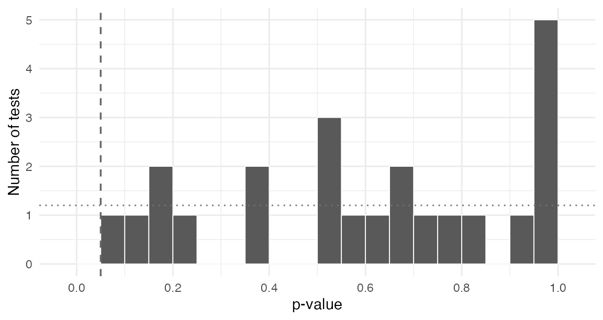
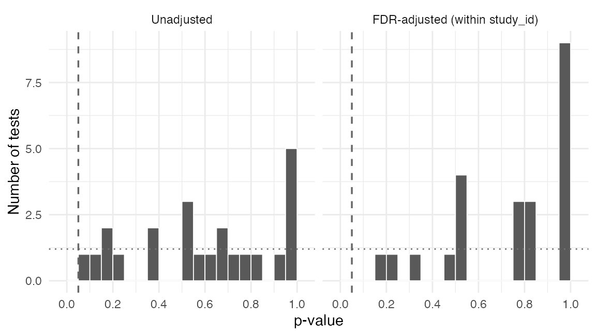

# Checking Many Studies at Once

``` r

library(excheckr)
```

A meta-analysis or a multi-study project runs the same handful of design
checks on every study it includes, and then has to make sense of several
hundred test results at once. This vignette covers that second half:
labelling per-study output so it can be stacked, collapsing it into one
object, and reading the result without fooling yourself.

The pattern has three stages.

1.  One checking script per study, writing its results to disk.
2.  [`stack_checks()`](https://alexandercoppock.com/excheckr/reference/stack_checks.md)
    to bind them into a single object.
3.  [`report_checks()`](https://alexandercoppock.com/excheckr/reference/report_checks.md)
    and the p-value diagnostics to decide what needs attention.

## Some studies to check

Real projects read cleaned data from disk. Here we simulate eight
studies that follow the column conventions the package expects: a
treatment `Z`, covariates prefixed `X_` with imputed `_nona` companions,
and outcomes prefixed `Y_` scaled to the unit interval.

Two studies are given deliberate problems, so there is something to
find.

``` r

set.seed(20260725)

simulate_study <- function(study_id, n = 800, imbalanced = FALSE,
                           attrition = FALSE, out_of_bounds = FALSE) {
  X_age <- rnorm(n, 50, 15)
  X_educ <- factor(sample(c("HS", "College", "Postgrad"), n, replace = TRUE))

  # An imbalanced study assigns treatment as a function of a covariate
  Z <- if (imbalanced) {
    rbinom(n, 1, plogis((X_age - 50) / 12))
  } else {
    rbinom(n, 1, 0.5)
  }

  Y_support <- plogis(0.4 * Z + 0.02 * (X_age - 50) + rnorm(n))
  Y_turnout <- plogis(0.2 * Z + rnorm(n))

  # Differential attrition: the treated drop out more often
  p_missing <- if (attrition) 0.05 + 0.20 * Z else 0.08
  Y_support[rbinom(n, 1, p_missing) == 1] <- NA

  if (out_of_bounds) Y_turnout <- Y_turnout * 100

  # A covariate with missing values, plus its imputed companion
  X_age[sample(n, round(0.05 * n))] <- NA

  data.frame(
    study_id = study_id, Z = Z,
    X_age = X_age, X_age_nona = ifelse(is.na(X_age), mean(X_age, na.rm = TRUE), X_age),
    X_educ = X_educ, X_educ_nona = X_educ,
    Y_support = Y_support, Y_turnout = Y_turnout
  )
}

studies <- c(sprintf("study_%02d", 1:8))
datasets <- lapply(studies, function(s) {
  simulate_study(
    s,
    imbalanced    = s == "study_03",
    attrition     = s == "study_05",
    out_of_bounds = s == "study_07"
  )
})
names(datasets) <- studies
```

## One checking script per study

In a real project each study gets its own script, so that a study’s
covariate list and quirks live next to the study rather than in a loop.
The important detail is `study_id`: every check takes it, and every
check appends it to its output, which is what makes the results
stackable later.

[`check_balance()`](https://alexandercoppock.com/excheckr/reference/check_balance.md)
normally returns a two-element list. Passing `flatten = TRUE` returns
one tibble instead, with a `test` column distinguishing the joint test
from the covariate-by-covariate tests.

``` r

check_dir <- file.path(tempdir(), "checks")
dir.create(check_dir, showWarnings = FALSE)

for (s in studies) {
  dat <- datasets[[s]]
  nona <- c("X_age_nona", "X_educ_nona")

  saveRDS(
    list(
      ybounds     = check_y_bounds(dat, study_id = s),
      missingness = check_missingness_nona(dat, study_id = s),
      balance     = check_balance(dat, Z, covariates = nona,
                                  study_id = s, flatten = TRUE),
      attrition   = check_attrition(dat, Z, outcomes = c("Y_support", "Y_turnout"),
                                    study_id = s)
    ),
    file.path(check_dir, paste0(s, "_checks.rds"))
  )
}

list.files(check_dir)
#> [1] "study_01_checks.rds" "study_02_checks.rds" "study_03_checks.rds"
#> [4] "study_04_checks.rds" "study_05_checks.rds" "study_06_checks.rds"
#> [7] "study_07_checks.rds" "study_08_checks.rds"
```

## When treatment was assigned within strata

Real corpora are rarely one experiment per study. A study may randomize
separately within partisanship and topic, in which case a check run on
the whole study answers the wrong question: it pools strata that were
randomized independently.

`.by` runs the check within each stratum and stacks the results, with
the grouping columns prepended.

``` r

stratified <- datasets[["study_01"]]
stratified$X_region <- rep(c("North", "South"), length.out = nrow(stratified))

check_attrition(stratified, Z, outcomes = "Y_support",
                .by = X_region, study_id = "study_01")
#> # A tibble: 2 × 11
#>   X_region outcome   F_stat   df1   df2 p_value  nobs n_missing status estimable
#>   <chr>    <chr>      <dbl> <int> <int>   <dbl> <int>     <int> <chr>  <lgl>    
#> 1 North    Y_support  0.136     1   398   0.713   400        30 tested TRUE     
#> 2 South    Y_support  1.44      1   398   0.231   400        36 tested TRUE     
#> # ℹ 1 more variable: study_id <chr>
```

The return shape is unchanged, so `.by` composes with everything else:
with `flatten = TRUE` for a single tibble, and with
[`check_balance()`](https://alexandercoppock.com/excheckr/reference/check_balance.md)’s
two-element list. Note also that a grouping column is hidden from the
check, so a stratifier named `X_region` is not then tested as a
covariate that happens to be constant within every stratum.

``` r

check_balance(stratified, Z, covariates = c("X_age_nona", "X_educ_nona"),
              .by = X_region, study_id = "study_01", flatten = TRUE) |>
  subset(test == "joint")
#> # A tibble: 2 × 15
#>   X_region test  covariate level F_stat statistic   df1   df2 p_value  nobs
#>   <chr>    <chr> <chr>     <chr>  <dbl> <chr>     <int> <int>   <dbl> <int>
#> 1 North    joint NA        NA     0.710 F             3   396   0.546   400
#> 2 South    joint NA        NA     0.504 F             3   396   0.680   400
#> # ℹ 5 more variables: study_id <chr>, p_value_classical <dbl>,
#> #   obs_per_param <dbl>, status <chr>, estimable <lgl>
```

Without `.by` this is a
[`nest()`](https://tidyr.tidyverse.org/reference/nest.html), a `map()`,
an [`unnest()`](https://tidyr.tidyverse.org/reference/unnest.html) per
returned element, and a trailing
[`mutate()`](https://dplyr.tidyverse.org/reference/mutate.html) to
attach `study_id`, because the argument cannot survive the `map()`. That
is worth knowing if you maintain scripts written before `.by` existed.

## Stacking

[`stack_checks()`](https://alexandercoppock.com/excheckr/reference/stack_checks.md)
reads every per-study file and binds it element-wise, so the `ybounds`
tibbles from all eight studies become one `ybounds` tibble. Elements
that are `NULL` or have no rows in a given file are dropped before
binding, so a study that contributes nothing to one check does not break
the others.

``` r

all_checks <- stack_checks(check_dir)

names(all_checks)
#> [1] "ybounds"     "missingness" "balance"     "attrition"
nrow(all_checks$balance)
#> [1] 32
```

The stacked object is a plain named list of tibbles, so anything
downstream is ordinary data manipulation.

``` r

head(all_checks$ybounds, 3)
#> # A tibble: 3 × 5
#>   variable     min   max in_bounds study_id
#>   <chr>      <dbl> <dbl> <lgl>     <chr>   
#> 1 Y_support 0.0238 0.976 TRUE      study_01
#> 2 Y_turnout 0.0425 0.974 TRUE      study_01
#> 3 Y_support 0.0600 0.981 TRUE      study_02
```

## Triage

[`report_checks()`](https://alexandercoppock.com/excheckr/reference/report_checks.md)
applies the filters that a human would apply by hand and returns only
the rows that failed. Its print method shows the counts.

``` r

report <- report_checks(all_checks)
report
#> excheckr triage report (alpha = 0.05)
#>       1  outcomes outside [0, 1]
#>       0  covariates missing with no imputed companion
#>       0  imputed companions that still contain NA
#>       1  joint balance tests flagged
#>       1  covariate balance tests flagged
#>       1  attrition tests flagged
#> Inspect an element with report$<name>.
```

The three planted problems surface, and each element is a tibble you can
inspect directly.

``` r

report$out_of_bounds[, c("study_id", "variable", "min", "max")]
#> # A tibble: 1 × 4
#>   study_id variable    min   max
#>   <chr>    <chr>     <dbl> <dbl>
#> 1 study_07 Y_turnout  5.00  96.5
report$attrition[, c("study_id", "outcome", "p_value")]
#> # A tibble: 1 × 3
#>   study_id outcome    p_value
#>   <chr>    <chr>        <dbl>
#> 1 study_05 Y_support 3.57e-11
```

One column in the stacked attrition results is worth knowing about
before the next section. An outcome that nobody skipped supports no
attrition test at all, and those rows carry `estimable = FALSE` with an
`NA` p-value rather than a p-value of 1. That distinction matters more
than it looks: a real corpus contains many outcomes with no attrition,
and reporting them as ones would put a spike at the top of the p-value
distribution and make the diagnostics below announce a badly non-uniform
collection when nothing at all is wrong.

``` r

table(all_checks$attrition$estimable)
#> 
#> FALSE  TRUE 
#>     8     8
```

## Reading the p-values honestly

The flagged balance tests deserve more care than the other two
categories, and this is where multi-study checking most often goes
wrong.

Under a valid design, balance test p-values are distributed Uniform(0,
1). That means roughly `alpha` of them fall below `alpha` **by
construction**. In a collection of a few hundred tests, a handful of
flags is what success looks like. Treating each flagged test as evidence
against the study that produced it, and dropping those studies, is a
reliable way to introduce exactly the bias the checks were meant to
detect.

The useful question is therefore not “which tests failed” but “does the
distribution look uniform”.
[`summarize_check_pvalues()`](https://alexandercoppock.com/excheckr/reference/summarize_check_pvalues.md)
answers it.

``` r

covariate_tests <- all_checks$balance[all_checks$balance$test == "covariate", ]

summarize_check_pvalues(covariate_tests)
#> # A tibble: 1 × 8
#>   n_tests n_dropped n_below pct_below expected_below n_below_fdr pct_below_fdr
#>     <int>     <int>   <int>     <dbl>          <dbl>       <int>         <dbl>
#> 1      24         0       1      4.17              5           1          4.17
#> # ℹ 1 more variable: ks_p <dbl>
```

`pct_below` is the observed rejection rate and `expected_below` is what
the design implies, so the two should be close. `pct_below_fdr` applies
a Benjamini-Hochberg correction, which is the right lens when you want
to know whether any individual test survives multiplicity.

Two columns deserve more suspicion than the rest. `n_dropped` counts
tests that could not be computed and were excluded. When it is large
relative to `n_tests`, the summary describes a subsample selected on
estimability rather than the corpus, and says nothing at all about the
studies that fell out. This is not a hypothetical: the joint balance
test relies on
[`nnet::multinom`](https://rdrr.io/pkg/nnet/man/multinom.html), which
fails to converge on small strata, and in one real corpus 802 of 1143
joint balance tests were unestimable while the summary reported
`n_tests = 341` without comment.

`ks_p` tests the whole distribution against the uniform, but it assumes
the p-values are independent and these are not. Within a study, the
indicators of one factor covariate are mechanically dependent,
correlated covariates add more, and the joint test is a function of all
of them. Read a small `ks_p` on a stacked collection as evidence of
dependence first and of a design problem second. The `pct_below` against
`expected_below` comparison is the more robust headline.

The `group` argument controls what the FDR correction is computed over.
Adjusting within study asks whether a given study looks broken;
adjusting across all tests asks whether the collection as a whole does.
They answer different questions, so the choice belongs at the call site
rather than in a default.

``` r

summarize_check_pvalues(covariate_tests, group = "study_id")
#> # A tibble: 1 × 8
#>   n_tests n_dropped n_below pct_below expected_below n_below_fdr pct_below_fdr
#>     <int>     <int>   <int>     <dbl>          <dbl>       <int>         <dbl>
#> 1      24         0       1      4.17              5           1          4.17
#> # ℹ 1 more variable: ks_p <dbl>
```

The picture is easier to read as a histogram against the uniform
reference. The dotted line is the expected height of each bar, and the
dashed line marks `alpha`.

``` r

plot_check_pvalues(covariate_tests)
#> Warning: Removed 2 rows containing missing values or values outside the scale range
#> (`geom_bar()`).
```



Setting `fdr = TRUE` adds the adjusted panel alongside the raw one.

``` r

plot_check_pvalues(covariate_tests, group = "study_id", fdr = TRUE)
#> Warning: Removed 4 rows containing missing values or values outside the scale range
#> (`geom_bar()`).
```



Because
[`plot_check_pvalues()`](https://alexandercoppock.com/excheckr/reference/plot_check_pvalues.md)
returns an ordinary `ggplot` object with minimal theming, a project
theme can be added to it in the usual way.

## Magnitude, not just significance

A p-value answers whether an imbalance is larger than chance would
produce. It does not answer whether the imbalance is large enough to
matter, and in a large sample a trivial difference will be significant.
[`check_smd()`](https://alexandercoppock.com/excheckr/reference/check_smd.md)
reports the standardized mean difference for each covariate against a
reference arm, dividing by the reference arm’s standard deviation so the
denominator is fixed across arms.

``` r

smd <- check_smd(datasets[["study_03"]], Z,
                 covariates = c("X_age_nona", "X_educ_nona"),
                 study_id = "study_03")

smd[, c("covariate", "level", "smd", "flag")]
#> # A tibble: 3 × 4
#>   covariate   level         smd flag 
#>   <chr>       <chr>       <dbl> <lgl>
#> 1 X_age_nona  NA        0.878   TRUE 
#> 2 X_educ_nona HS       -0.101   TRUE 
#> 3 X_educ_nona Postgrad -0.00142 FALSE
```

This is the imbalanced study, and `X_age_nona` is flagged at the
conventional 0.1 threshold. Running the same call on a sound study
returns small values, which is the comparison worth making.

``` r

check_smd(datasets[["study_01"]], Z,
          covariates = c("X_age_nona", "X_educ_nona"))[, c("covariate", "smd", "flag")]
#> # A tibble: 3 × 3
#>   covariate         smd flag 
#>   <chr>           <dbl> <lgl>
#> 1 X_age_nona  -0.000529 FALSE
#> 2 X_educ_nona -0.127    TRUE 
#> 3 X_educ_nona  0.0904   FALSE
```

## Where this leaves you

The output of this workflow is a decision about which studies need a
closer look, not an automatic exclusion rule. Out-of-bounds outcomes and
covariates missing an imputed companion are usually cleaning errors and
worth fixing at source. A single flagged balance test usually is not
worth acting on. A distribution of balance p-values that is visibly
non-uniform is.

For the calibration behind the balance tests themselves, including how
the joint test behaves as the number of arms grows and when
randomization inference is worth the trouble, see
[`vignette("balance_testing", package = "excheckr")`](https://alexandercoppock.com/excheckr/articles/balance_testing.md).
